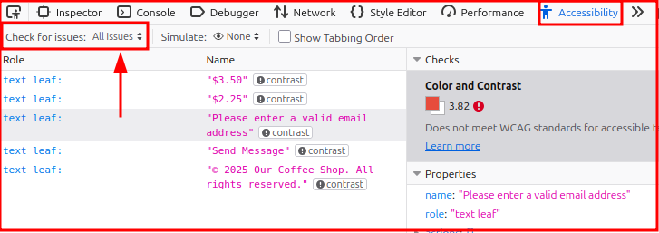
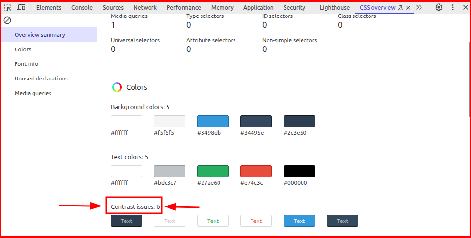
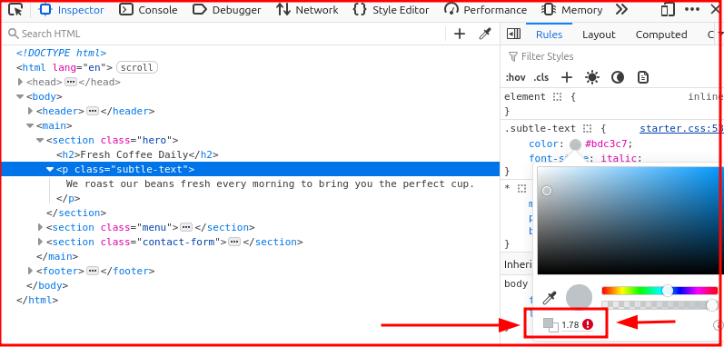

# Challenge 2: Color Contrast

## The Problem
Open `challenge.html` in your browser. Notice how hard some text is to read? That's what we're fixing!

## Your Mission
1. **First, experience the problem:**
   - Squint at your screen
   - Try reading from far away
   - Imagine you're in bright sunlight

2. **Learn to test contrast:**
   - Right-click on the gray text → Inspect
   - Different browsers have different DevTools, but look for:
     - Firefox: `Accessibility` tab > "Check for issues: Contrast" or "Check for issues: All"
     
     - Chromium-based browsers (Chrome, Edge, Brave): `CSS Overview` tab > "Capture Overview" > "Contrast Issues"
     
   - DevTools will show you color suggestions to improve contrast (or at least show you whether the color is up to standards)
      - For Firefox, in the `Elements` tab > `Styles` panel, if you click on the color swatch, it will show you the contrast ratio and suggest accessible colors.
      
      - For Chromium-based browsers, go to `Elements` tab > `Rules` panel, and click on the color swatch to see the contrast ratio and suggestions.

3. **Fix the CSS:**
   Open `starter.css` and improve the contrast for:
   - The `.subtle-text` class
   - The `.error-message` class (hint: don't just change the text color!)
   - The `.link` hover state

## Success Criteria
- All text passes WCAG AA standards (4.5:1 for normal text)
- Error messages are noticeable without relying only on color
- Links are distinguishable from regular text

## 💡 Tips
- Darker backgrounds need lighter text
- Pure black (#000) on pure white (#fff) can be harsh - try #212121
- The DevTools contrast checker suggests accessible colors!

## Test Your Solution
- [ ] All text is easily readable
- [ ] DevTools shows no contrast warnings
- [ ] Error message uses more than just color (try icon or border)
- [ ] Check your solution against `solution.css` to see if there's anything else you could add

## Bonus Challenge
Can you maintain the site's visual style while fixing accessibility? Good design and accessibility can coexist!

---
When ready, move on to `03-focus-indicators/`
